# Shilatech Auto Spares — Website & Staff Portal User Manual

This manual explains how to use the Shilatech Auto Spares website.

- **Part 1** is for customers and visitors.
- **Part 2** is for staff (warehouse, sales counter, garage, delivery, finance, HR, managers and administrators).
- **Part 3** is a quick reference and troubleshooting guide.

> **How this manual was written.** It was prepared from the application's source code (pages, role rules and workflow documents in `docs/`). Screen names and button labels match the code. If your deployment has been customised, small differences are possible.

---

## Contents

1. [Part 1 — Customer website](#part-1--customer-website)
   - [1.1 Finding your way around](#11-finding-your-way-around)
   - [1.2 Home page](#12-home-page)
   - [1.3 Shop: searching and filtering parts](#13-shop-searching-and-filtering-parts)
   - [1.4 Product page](#14-product-page)
   - [1.5 Brands](#15-brands)
   - [1.6 VIN checker](#16-vin-checker)
   - [1.7 Cart and checkout](#17-cart-and-checkout)
   - [1.8 Customer account and My Garage](#18-customer-account-and-my-garage)
   - [1.9 Workshop booking](#19-workshop-booking)
   - [1.10 Contact, FAQ, Delivery & Returns, About, Facility](#110-contact-faq-delivery--returns-about-facility)
2. [Part 2 — Staff portal](#part-2--staff-portal)
   - [2.1 Signing in for the first time](#21-signing-in-for-the-first-time)
   - [2.2 The staff bar and Staff centre](#22-the-staff-bar-and-staff-centre)
   - [2.3 Who can open what (roles)](#23-who-can-open-what-roles)
   - [2.4 Warehouse](#24-warehouse)
   - [2.5 Sales counter (POS)](#25-sales-counter-pos)
   - [2.6 Garage jobs](#26-garage-jobs)
   - [2.7 Delivery](#27-delivery)
   - [2.8 Requests & approvals](#28-requests--approvals)
   - [2.9 Sales & customer accounts (Receivables) and Finance workspace](#29-sales--customer-accounts-receivables-and-finance-workspace)
   - [2.10 ERP & payroll](#210-erp--payroll)
   - [2.11 My HR](#211-my-hr)
   - [2.12 Reports & administration (Admin dashboard)](#212-reports--administration-admin-dashboard)
   - [2.13 Operations & staff (management)](#213-operations--staff-management)
3. [Part 3 — Quick reference](#part-3--quick-reference)
   - [3.1 Page address (URL) list](#31-page-address-url-list)
   - [3.2 Troubleshooting](#32-troubleshooting)
   - [3.3 Things that are not connected yet](#33-things-that-are-not-connected-yet)
   - [3.4 Known issues (for the administrator / IT)](#34-known-issues-for-the-administrator--it)

---

# Part 1 — Customer website

## 1.1 Finding your way around

*Every public page has the same header (menu, search, account, cart) and footer.*

Every public page has the same header and footer.

**Top bar (very top of the page):** phone number, email address, and delivery / original-parts / secure-payment reminders.

**Main menu:**

| Menu item | Takes you to |
|---|---|
| **Home** | Home page |
| **Shop** | The full parts catalogue |
| **Brands** | Jeep, Mercedes-Benz, Volkswagen, Range Rover, Volvo and Ford |
| **Workshop** | Garage services and booking form |
| **Facility** | Photos and concept of the flagship facility |
| **About Us** | The Shilatech story |
| **Contact** | Parts enquiry page |
| **Staff portal** | Staff sign-in (staff only — see Part 2) |

**Right-hand side of the header:**

- **Search box** ("Search parts, brands…") — type a part name, brand or part number and press Enter. You are taken to the Shop with your search applied.
- **♙ (person icon)** — your customer account.
- **🛒 (cart icon)** — your cart. The number shows how many items it holds.

**Footer:** shortcuts to *Shop* (All parts, Vehicle brands, VIN checker, Cart), *Support* (Book a repair, FAQ, Delivery & Returns, Contact) and *Dealer* (Admin dashboard, Staff sales counter — staff only).

The site works on phones, tablets and computers.

## 1.2 Home page

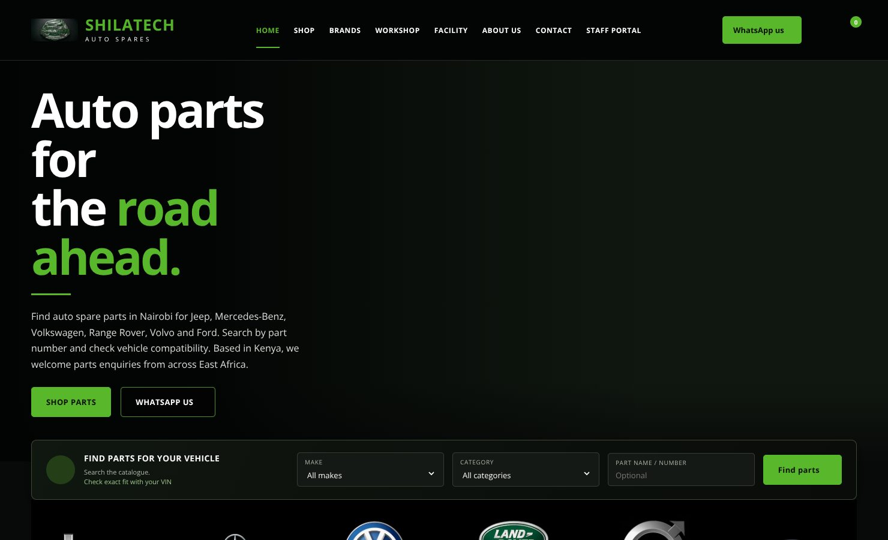

*Home page with the VIN / make / category search.*

The home page is the starting point. It contains:

- A **VIN search** ("Find parts for your vehicle") — see [1.6](#16-vin-checker).
- Quick category links (**Brakes, Engine, Suspension**) that open the Shop already filtered.
- **Featured auto spare parts.**
- A **Workshop** section with a *Book a workshop visit* button.
- A **WhatsApp** link (+254 721 802 597) for quick enquiries.
- Short guides on choosing the right part and common questions.

## 1.3 Shop: searching and filtering parts

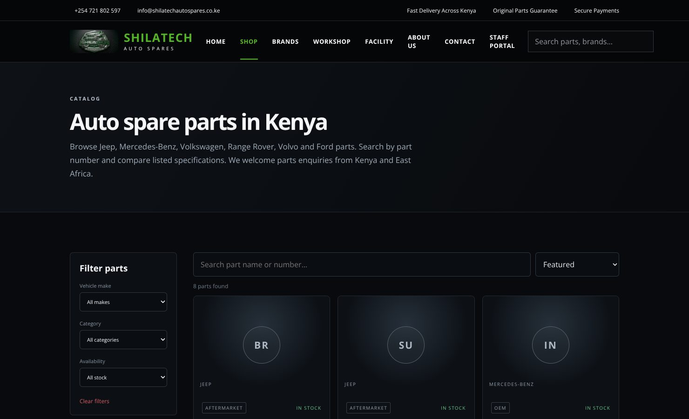

*Shop: filters on the left, search and sorting above the results.*

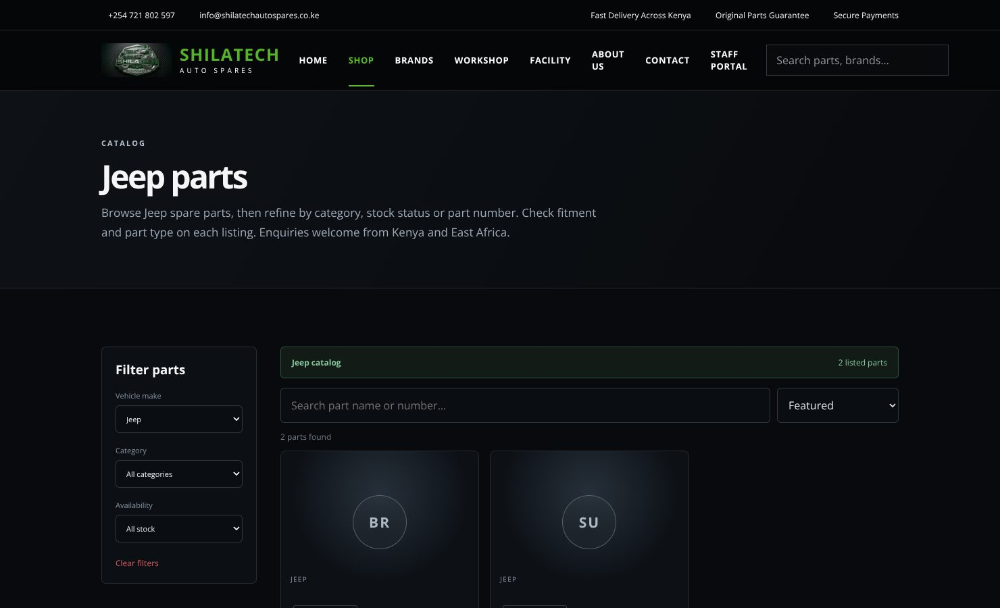

*Shop opened from Brands, filtered to Jeep.*

Open **Shop** from the menu. The page heading changes to match what you are viewing (for example "Jeep parts").

**Filter panel (left side):**

1. **Vehicle make** — choose a brand or leave on *All makes*.
2. **Category** — for example Engine, Brakes, Suspension, Electrical, Body, Interior.
3. **Availability** — *All stock* or *In stock* only.
4. **Clear filters** — resets everything.

**Above the results:**

- **Search part name or number…** — results update as you type.
- **Sort** — *Featured*, *Price: Low to high*, *Price: High to low*.
- A line such as "**12 parts found**" tells you how many results match.

**Each part card shows:** brand, part type (OEM / Aftermarket / Genuine), whether it is *In stock* or *Backorder*, the name, the part number and the price in KSh. Click the name or picture to open the product page, or press **Add to cart**.

**Tip:** if nothing is listed, the page suggests contacting Shilatech with your VIN and the part you need — parts that are not listed online can often be sourced.

## 1.4 Product page

*Product page with part number, price, stock and compatibility.*

Click any part to see its full page.

- **Breadcrumb** at the top (Home / Auto spare parts / part name) to go back.
- Part type, stock level ("12 in stock" or "Out of stock"), name and **part number**.
- Compatible models, years and engine where recorded, and a short overview.
- **Add to cart** button.

Always check the part number and your VIN before ordering.

## 1.5 Brands

*Brands page.*

The **Brands** page lists the six makes we specialise in with the main models for each. Click **Browse [brand] parts →** to open the Shop filtered to that make. The **Find parts by VIN** button takes you to the VIN checker.

## 1.6 VIN checker

*VIN checker.*

Use your **VIN** (Vehicle Identification Number) for the best part matching. It is 17 characters and is found on the dashboard (visible through the windscreen), on the door frame, or in the logbook.

1. Open **VIN** (from the home page search or the footer link *VIN checker*).
2. Type or paste the 17 characters. **Rules:** numbers and capital letters only; the letters **I, O and Q are never used**.
3. Press the search button. The site identifies make, model, year and engine.
4. You are taken to the **Shop** with a banner "VIN-assisted search active".
5. In the **Parts catalogue for this vehicle** box you can:
   - Press **Browse full catalogue** and click a **category** button, or
   - Type a description such as *brake pads* and search.
6. Catalogue results are **references only** — stock and price are *not* confirmed. Press **Request this part** to send us the part number (and your VIN) through the Contact page.

If the VIN is not recognised, use **Search manually** to browse by make, model and category.

## 1.7 Cart and checkout

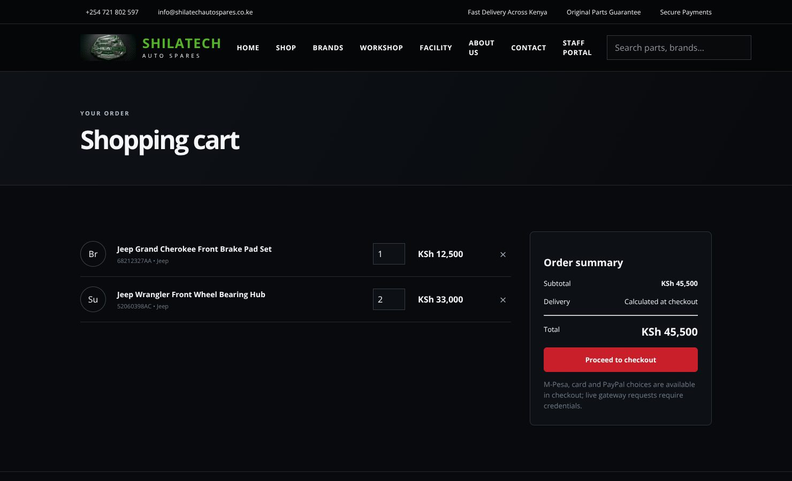

*Shopping cart.*

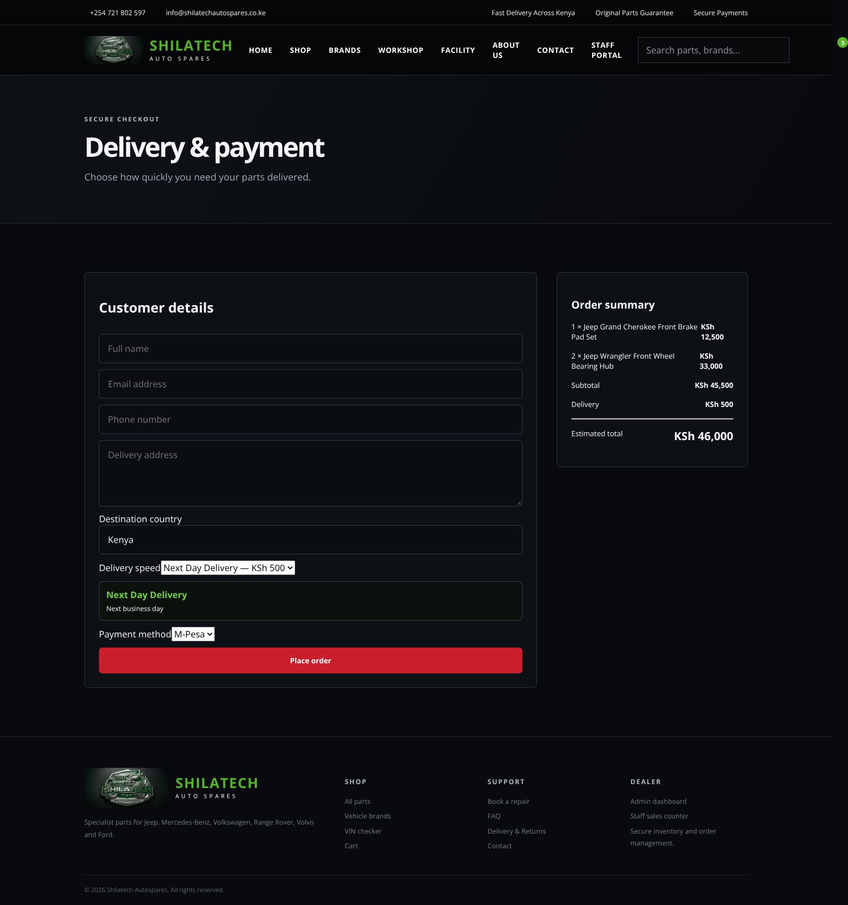

*Checkout: customer details, delivery speed and payment method.*

**Cart (🛒):**

- Change the **quantity** in the number box, or press **×** to remove an item.
- The summary shows the subtotal. Delivery is calculated at checkout.
- Press **Proceed to checkout**. (The button is disabled while the cart is empty.)

**Checkout — "Delivery & payment":**

1. Enter **Full name, Email, Phone number** and **Delivery address**.
2. **Destination country** — leave as *Kenya* for local delivery.
3. **Delivery speed** (Kenya only):

   | Option | Cost | Time |
   |---|---|---|
   | 2 Hour Delivery | KSh 1,200 | Within 2 hours |
   | 4 Hour Delivery | KSh 900 | Within 4 hours |
   | 8 Hour Delivery | KSh 700 | Within 8 hours |
   | Next Day Delivery | KSh 500 | Next business day |

   For any other country an **international estimate** is shown instead: courier (minimum KSh 4,500, or 8% of the order) plus a customs/tax provision (20%). These are estimates only; final charges depend on the destination.
4. **Payment method** — *M-Pesa*, *Card* or *PayPal*.
5. Check the **Order summary** on the right, then press **Place order**.

After ordering you see an **Order received** page with your order number, total, delivery details and payment status. Press **View my account** to track it.

> **Note:** live card/PayPal charges require provider credentials to be set up. Until then, an order is created with its payment status shown on the confirmation page, and the team follows up with you.

## 1.8 Customer account and My Garage

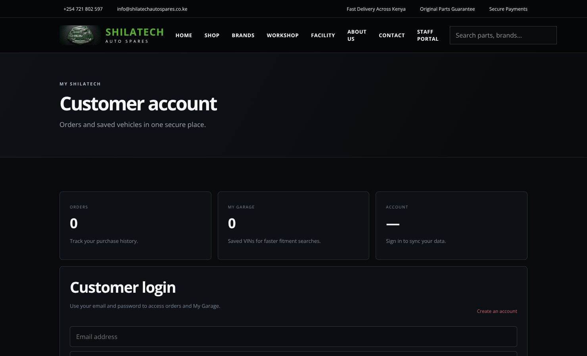

*Customer account sign-in / registration.*

Open **♙** (or the *Account* page).

- **New customer:** press **Create an account**, then enter full name, phone number, email and a password.
- **Returning customer:** enter email and password. Use **I already have an account** to switch back from the sign-up form.
- The page shows three tiles: **Orders** (your purchase history), **My Garage** (saved vehicles) and **Account** (your email).
- **My Garage:** enter a VIN and save it. Saved vehicles make later fitment searches faster.
- Press **Sign out** when you finish on a shared computer.

**Staff must not use this page to sign in.** Customer accounts cannot open staff tools. Staff use *Staff portal* ([2.1](#21-signing-in-for-the-first-time)).

## 1.9 Workshop booking

*Workshop page.*

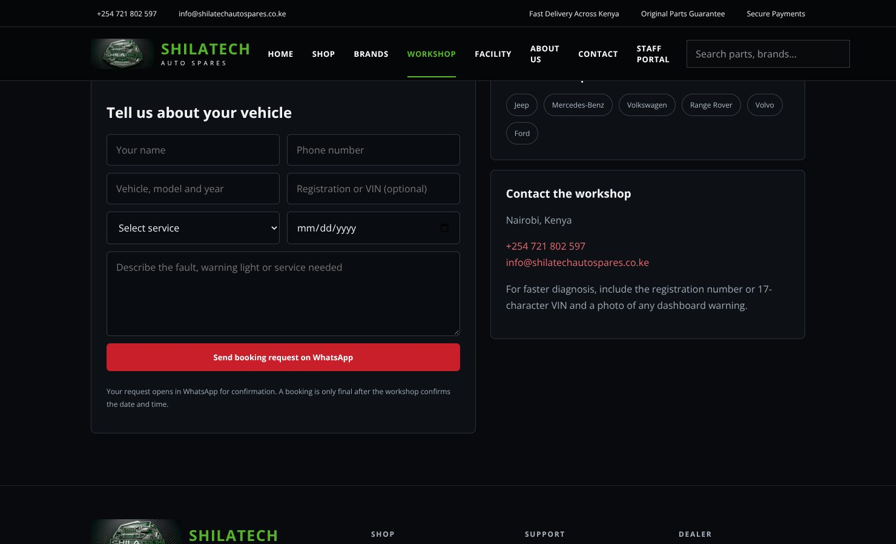

*Booking form (opens WhatsApp with your details).*

The **Workshop** page describes the garage services: computer diagnostics, routine servicing, brakes & suspension, engine & cooling, electrical repairs and pre-purchase inspection. It also explains the four steps: **Book → Inspect → Approve → Repair & test**.

To book:

1. Press **Book a workshop visit** (or scroll to *Request a booking*).
2. Fill in name, phone, vehicle (model and year), registration or VIN (optional), the service, preferred date and any details.
3. Press the submit button. **WhatsApp opens** with your details already typed in. Press send in WhatsApp to complete the booking request.

You can also call **+254 721 802 597**. For faster diagnosis, include the registration or VIN and a photo of any dashboard warning.

## 1.10 Contact, FAQ, Delivery & Returns, About, Facility

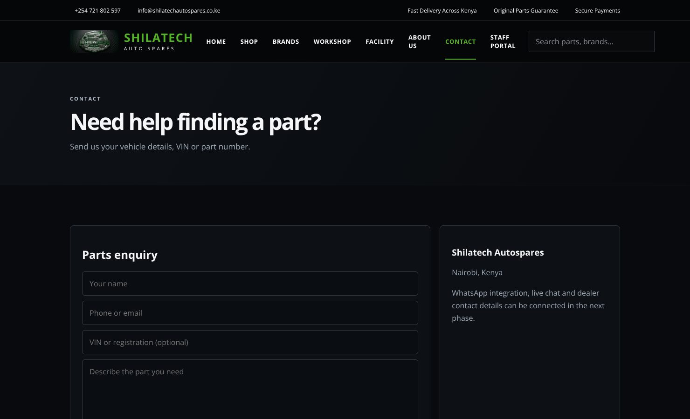

*Contact page.*

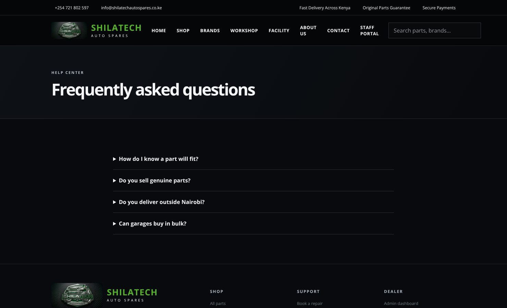

*FAQ.*

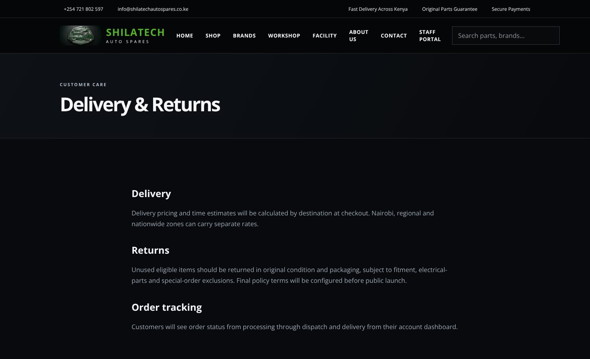

*Delivery & Returns.*

- **Contact** — shows the parts enquiry form and the Shilatech details.
  > The on-page **Send enquiry** button does not send anything yet. For now, contact us by **phone, email or WhatsApp** (+254 721 802 597, info@shilatechautospares.co.ke). See [3.3](#33-things-that-are-not-connected-yet).
- **FAQ** — click a question to expand the answer.
- **Delivery & Returns** — delivery, returns, warranty and order-tracking information.
- **About Us** — the Shilatech story, specialist focus and promise.
- **Facility** — the proposed flagship facility concept.

---

# Part 2 — Staff portal

Staff tools are private. They never appear in search engines and cannot be opened without a staff account.

## 2.1 Signing in for the first time

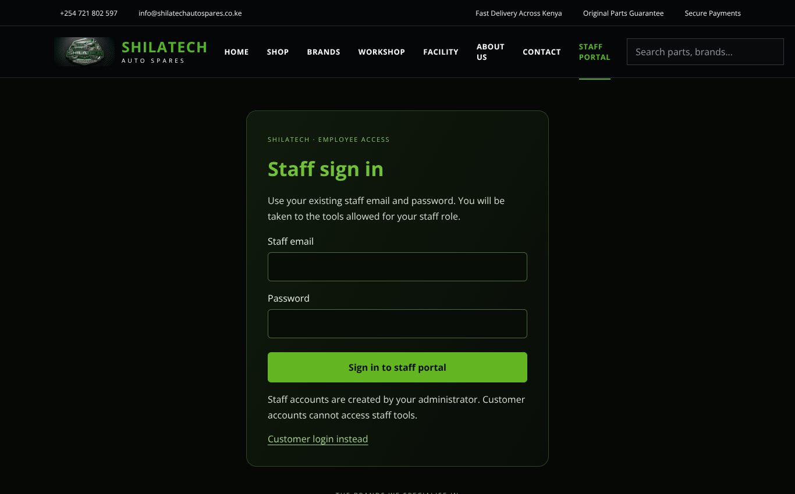

*Staff sign-in page.*

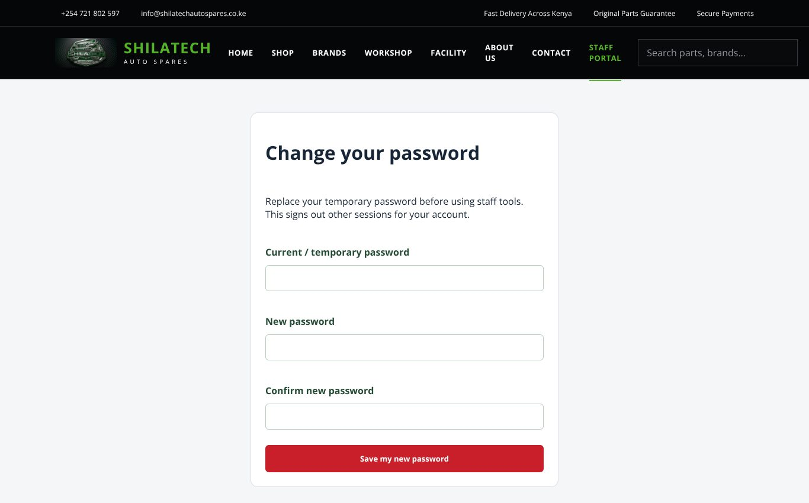

*Change-password page shown for a temporary password.*

1. On the website menu press **Staff portal** (or go to `/staff-login`).
2. Enter your **Staff email** and **Password**, then press **Sign in to staff portal**.
3. You are sent straight to the tools for your role (for example a cashier opens the Sales counter).

**Temporary password.** Accounts created by the administrator (and accounts whose password was reset) start with a *temporary* password. On first sign-in you will see **"Change your temporary password"**:

1. Press **Change password** (page `/staff-password`).
2. Enter the **current / temporary password**, then the **new password** twice. The new password must be **at least 12 characters**.
3. Press **Save my new password**. This signs out any other sessions on your account. You are then taken to your department.

**Note:** if you open any staff page directly while still on a temporary password, you will see the same *Change your temporary password* screen. Until the password is changed, the system refuses every staff action.

**Signing out:** press **Sign out** at the right of the staff bar. Always sign out on shared computers.

**If you see "Welcome to the staff portal / available only to authorised staff":** you are either not signed in or your role does not include that page. Press the button on the screen (*Staff sign in* or *Open my department*).

**Customer accounts cannot sign in here.** Staff accounts are created by the administrator — ask them if you do not have one.

## 2.2 The staff bar and Staff centre

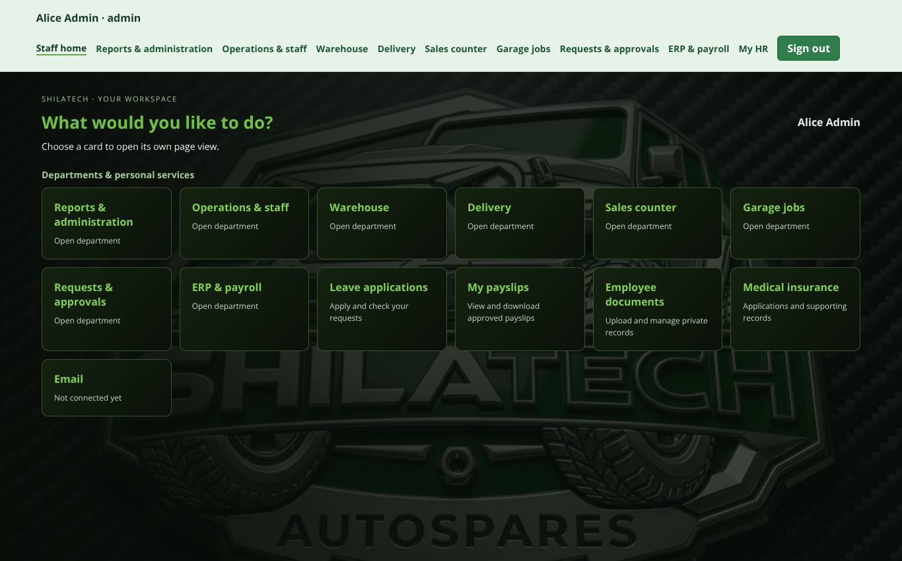

*Staff centre for an administrator: staff bar on top, one card per department.*

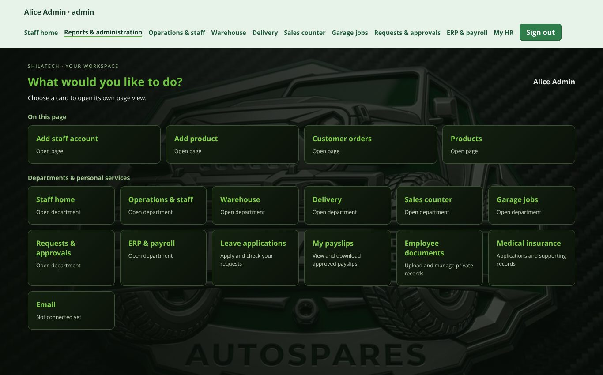

*A department dashboard (Reports & administration): function cards under *On this page*.*

Once signed in, a **staff bar** is shown at the top of every staff page:

- On the left: **your name and role**.
- In the middle: a link for each page you may open (for example *Warehouse*, *Sales counter*, *Requests & approvals*, *My HR*). The current page is highlighted.
- On the right: **Sign out**.

**Staff centre (`/staff`)** is the home page for administrators and general managers. It shows one tile for every department; press a tile (*Open department →*) to enter it.

**Department dashboard.** Every department opens on a **"What would you like to do?"** screen made of cards:

- **On this page** — the functions of that department (for example *Pick, pack & dispatch*, *Receive parts*, *Create counter sale*, *New garage booking*).
- **Departments & personal services** — shortcuts to the other departments you may use, plus your personal HR services (*Leave applications, My payslips, Employee documents, Medical insurance, Email*).

Press a card to open only that function. Use the **Back to dashboard** button to return and pick another. Anything you have started typing is kept when you switch functions.

## 2.3 Who can open what (roles)

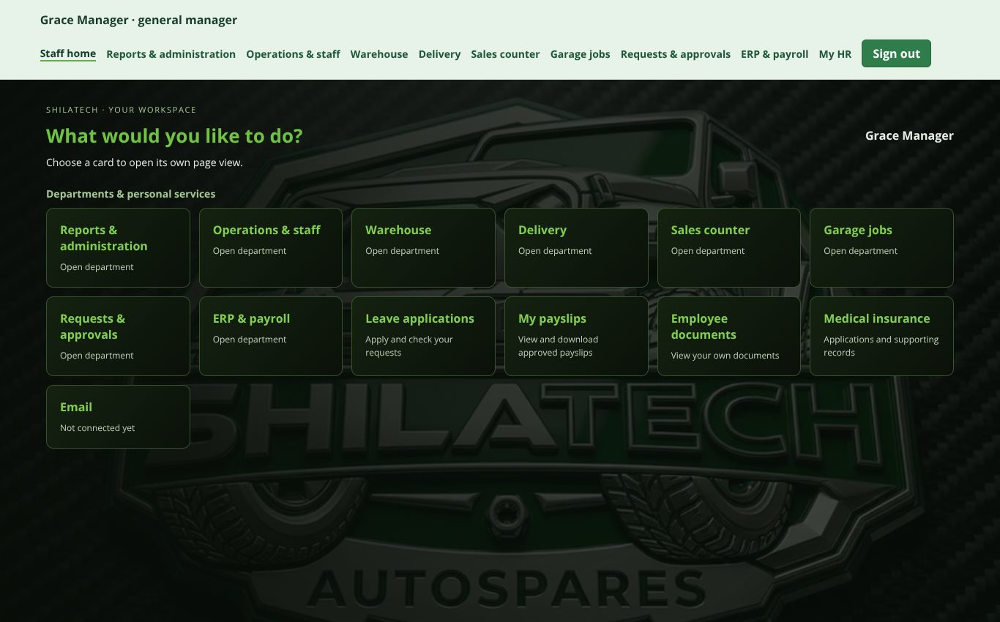

*General manager's Staff centre — same departments as the administrator, view only.*

| Role | Pages available |
|---|---|
| **Administrator** (`admin`) | Everything: Staff home, Reports & administration, Operations & staff, Warehouse, Delivery, Sales counter, Garage jobs, Requests & approvals, ERP & payroll, My HR — plus Sales & customer accounts / Finance workspace by typing `/receivables` |
| **General manager** (`general_manager`) | Same pages as the administrator, but **view only** — except Requests & approvals, payroll review and leave decisions. Cannot directly change stock, prices or sales |
| **Warehouse manager** (`warehouse_manager`) | Warehouse, Requests & approvals, My HR |
| **Warehouse clerk** (`warehouse_clerk`) | Warehouse (receiving, imports, returns, preorders), Requests & approvals, My HR |
| **Warehouse operator** (`warehouse_operator`) | Warehouse: the whole fulfilment chain on one card (pick, pack, dispatch, deliver with recipient signature and M-Pesa prompt), Requests & approvals, My HR |
| **Dispatch** (`dispatch`) | Warehouse (ready for dispatch, mark dispatched, returns), Delivery, Requests & approvals, My HR |
| **Auditor** (`auditor`) | Warehouse (viewing), Requests & approvals, My HR |
| **Cashier** (`cashier`) | Sales counter, Requests & approvals, My HR; also uses *Sales & customer accounts* (`/receivables`) for their own documents |
| **Garage staff** (`garage_staff`) | Garage jobs, Requests & approvals, My HR |
| **Delivery driver** (`delivery_driver`) | Delivery (own jobs only), Requests & approvals, My HR |
| **Finance** (`finance`) | Sales & customer accounts and Finance workspace (`/receivables`, opens automatically after sign-in), plus Requests & approvals (view everything, submit refund / correction requests) |
| **HR** (`hr`) | My HR only (HR administration) |

**Brand-assigned warehouse accounts.** A warehouse account whose email starts with a brand name — for example `jeep@…`, `mercedesbenz@…`, `volkswagen@…`, `rangerrover@…`, `volvo@…`, `ford@…` — can see and work on **that brand's storage area only**.

## 2.4 Warehouse

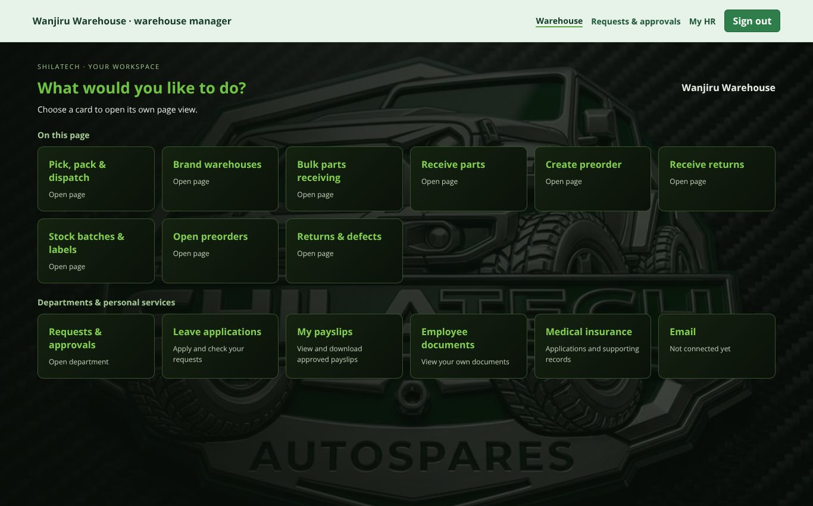

*Warehouse dashboard (warehouse manager).*

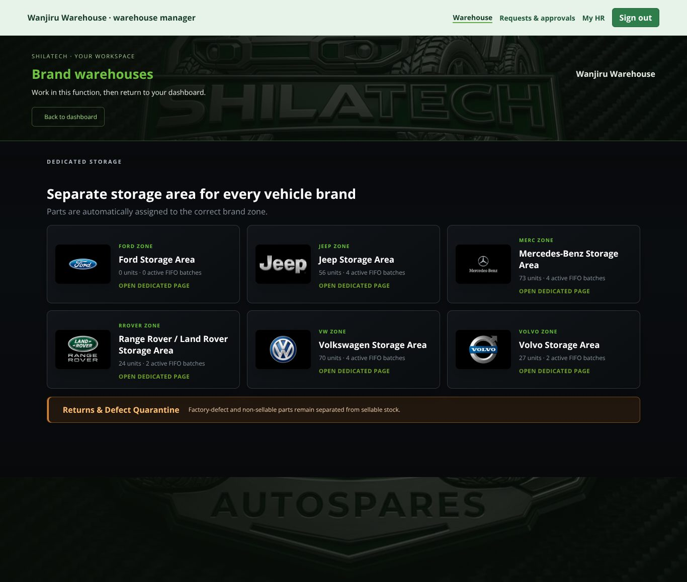

*Brand warehouses: one storage area per vehicle brand.*

**Open:** staff bar → **Warehouse** (`/warehouse`). Roles: warehouse manager, warehouse operator, clerk, dispatch, auditor; administrator and general manager (view only).

The warehouse has **six brand storage areas** — one for each vehicle brand. Parts are automatically assigned to the correct brand zone. Press a brand tile to focus on that brand; press **← Back to all warehouses** to return.

Functions (cards):

### Customer order fulfilment queue — *Pick, pack & dispatch*

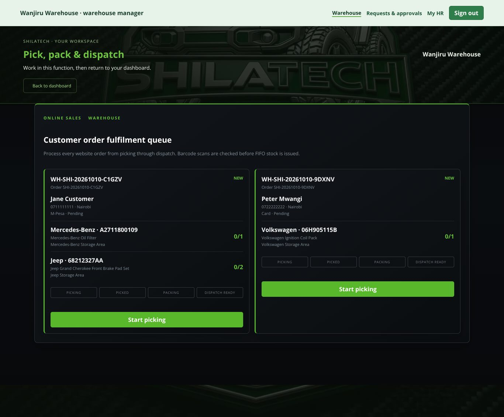

*Fulfilment queue: Start picking → Scan & pick → Start packing → Ready for dispatch → Mark dispatched.*
Handles every website order from picking through delivery, on one card. A warehouse operator does the whole chain; dispatch and warehouse manager accounts can also run any step.

1. **Start picking** (warehouse operator / warehouse manager).
2. **Scan & pick** each item. The barcode scan is checked and stock is issued using **FIFO** (oldest stock first).
3. **Start packing** once every item is picked.
4. **Ready for dispatch** once packed. This creates the delivery job.
5. **Mark dispatched**. For M-Pesa orders, the payment panel appears on the card: use **Prompt customer to pay**, ask the customer to complete the prompt, then **Refresh payment status**.
6. **Customer signed — mark Delivered**. Once the order is out for delivery, enter the recipient name, capture the customer's signature in the white box, add optional notes and submit. Delivery is blocked until an M-Pesa order shows as paid. The order is then marked delivered and the proof is stored.

Existing picker and packer accounts are converted to *Warehouse operator* when the database migration runs (`npm run db:migrate`). Those staff sign in again to pick up the new role.

### Receive stock — *Receive parts*

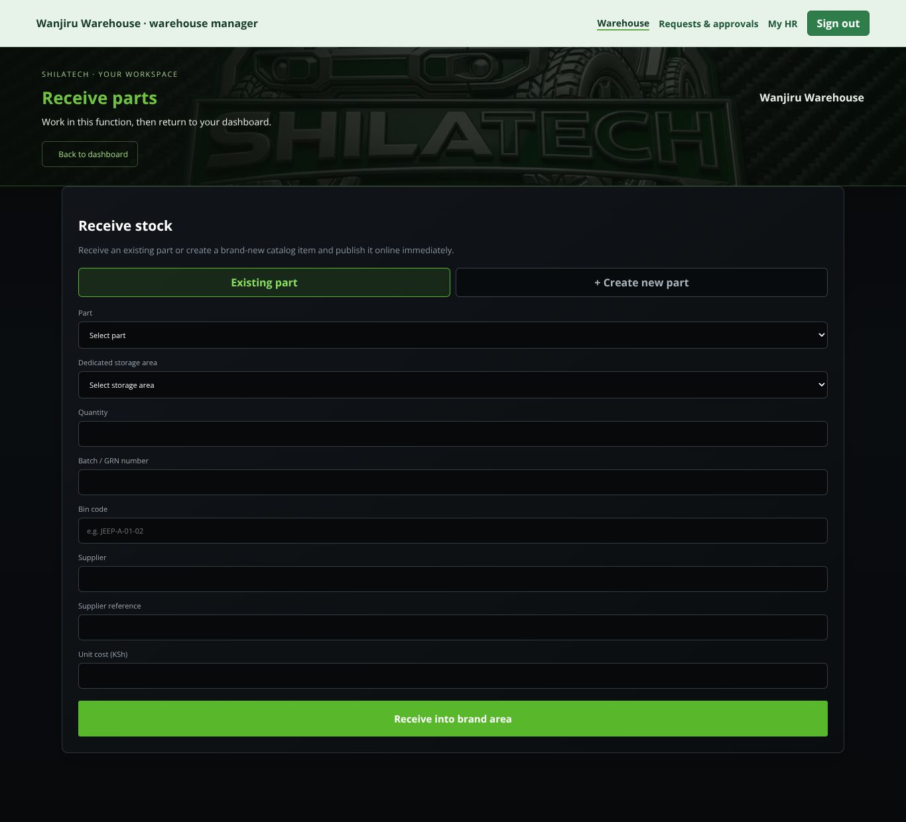

*Receive stock form.*
(Warehouse manager or clerk.)

1. Choose **Existing part** (pick it from the list) or **+ Create new part** (enter vehicle brand, part number / SKU, name, category, OEM / Aftermarket / Genuine, selling price, compatible models, years, engine, optional image URL). A new part is published online immediately.
2. Choose the **Dedicated storage area**, **Quantity**, **Batch / GRN number**, **Bin code**, **Supplier**, **Supplier reference** and **Unit cost (KSh)**.
3. Save. Each delivery becomes its own stock **batch**.

> Products created in Reports & administration start with **zero stock**. Stock is added only by receiving it here, so that every unit has a batch history.

### Upload parts from CSV — *Bulk receiving*

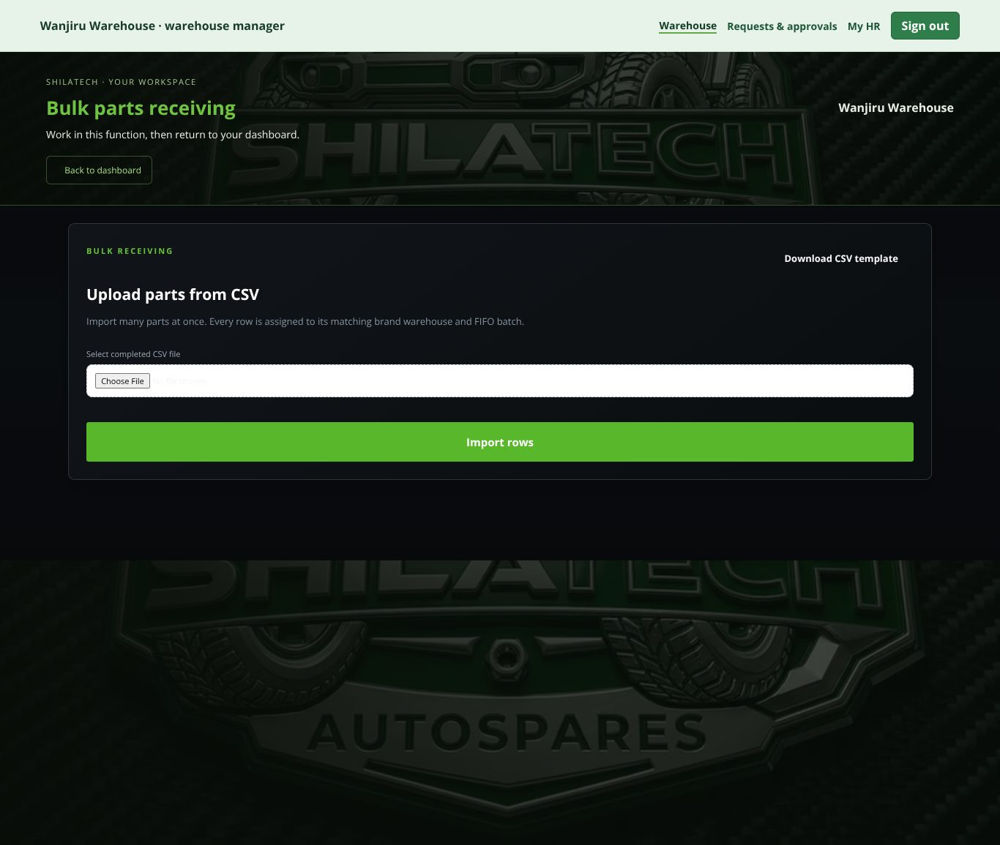

*Bulk CSV import.*
(Warehouse manager or clerk.) Press **Download CSV template**, fill it in, then **Select completed CSV file** and upload. Every row goes to its brand warehouse and its own FIFO batch.

### Create preorder

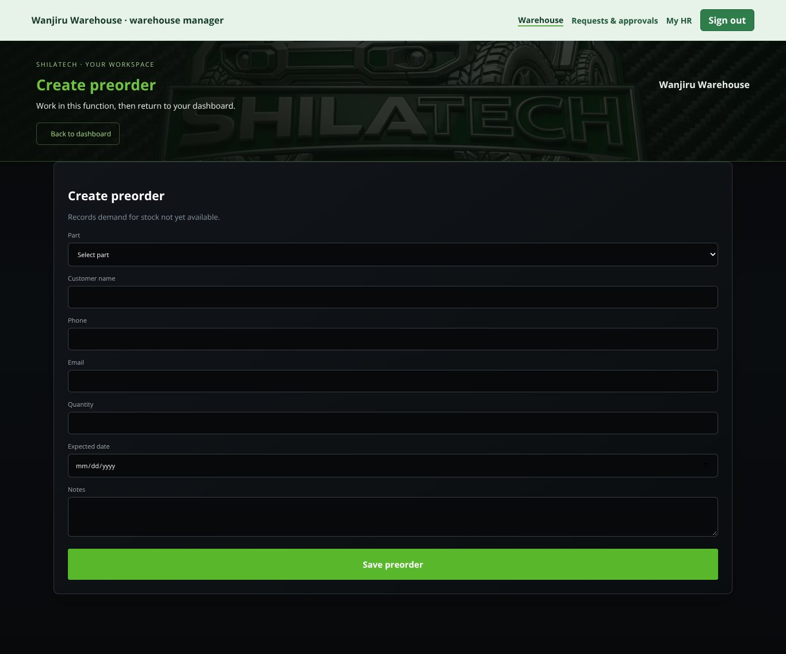

*Create preorder.*
Records demand for stock that has not arrived yet: customer name, phone, expected date, notes. Press **Save preorder**. Open preorders are listed under *Open preorders*.

### Return / factory defect — *Receive returns*

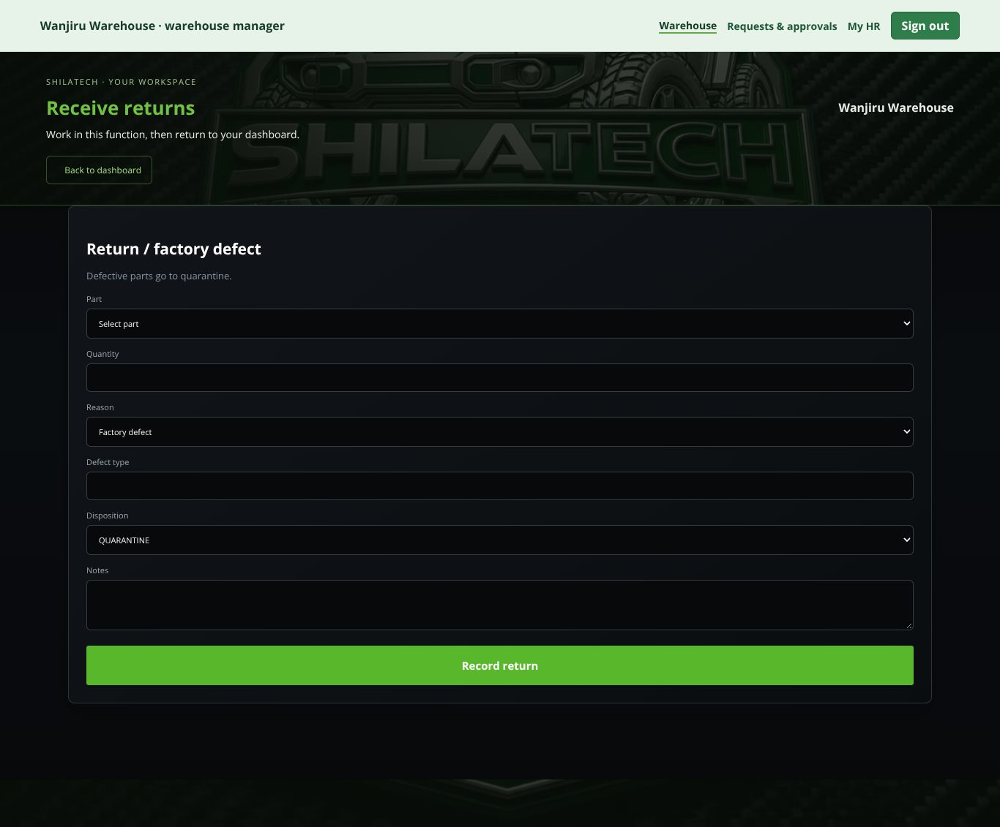

*Return / factory defect form.*
Choose the reason (*Factory defect*, *Customer return*, *Wrong part*) and record it. **Defective parts go to quarantine.** Open items appear under *Open returns & defects*.

### Stock batches & labels

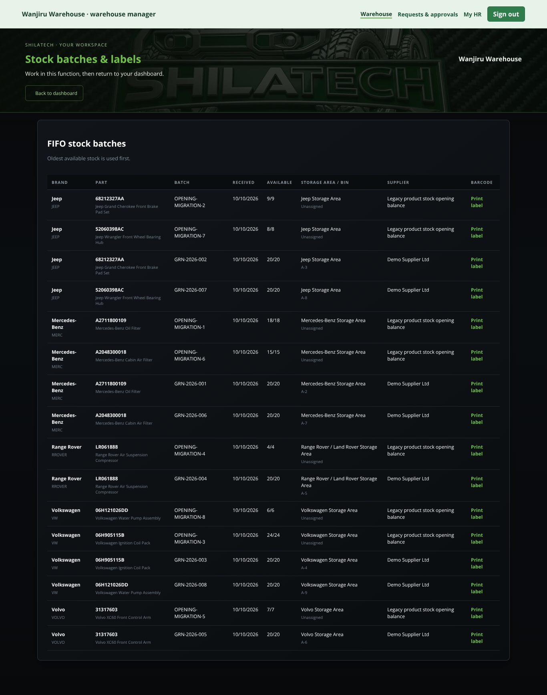

*FIFO stock batches with *Print label* links.*
Shows FIFO stock batches. Barcode labels can be generated for received parts.

**Rules to remember**

- You cannot edit a product's stock number directly. Receive new stock, or raise a **Stock adjustment** request ([2.8](#28-requests--approvals)) after a physical count.
- If the system warns that stock needs *reconciliation*, **stop selling that part** and tell a manager — nothing is auto-corrected.

## 2.5 Sales counter (POS)

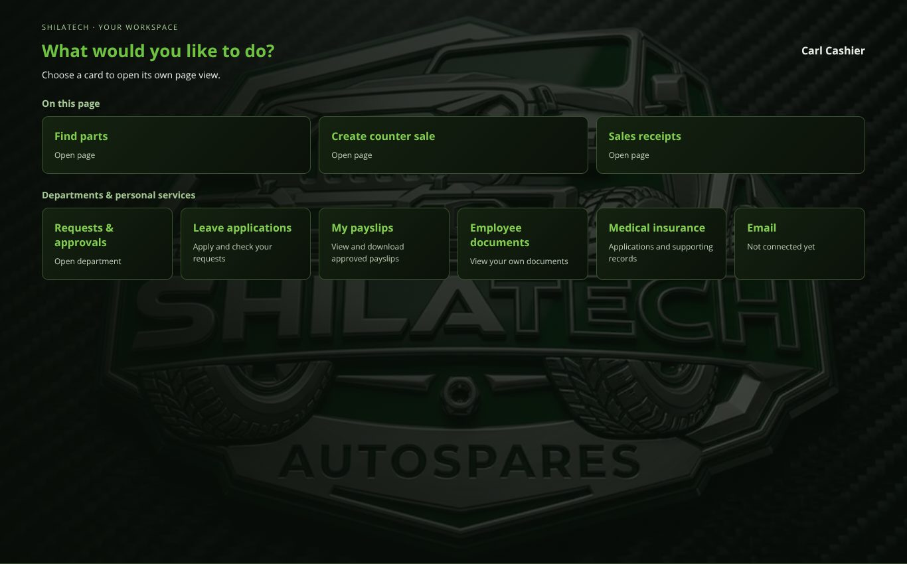

*Sales counter dashboard (cashier).*

**Open:** staff bar → **Sales counter** (`/pos`). Roles: cashier and administrator can sell; general manager can view.

### Making a sale

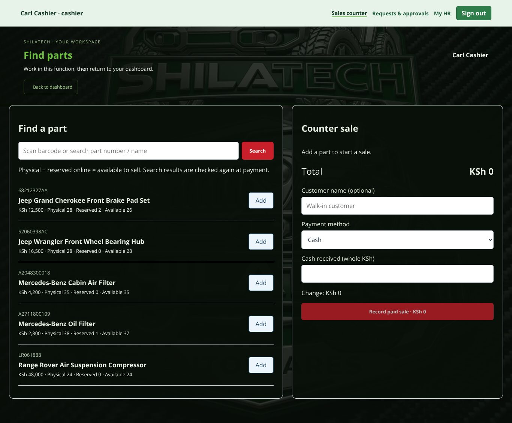

*Find a part (left) and Counter sale (right).*

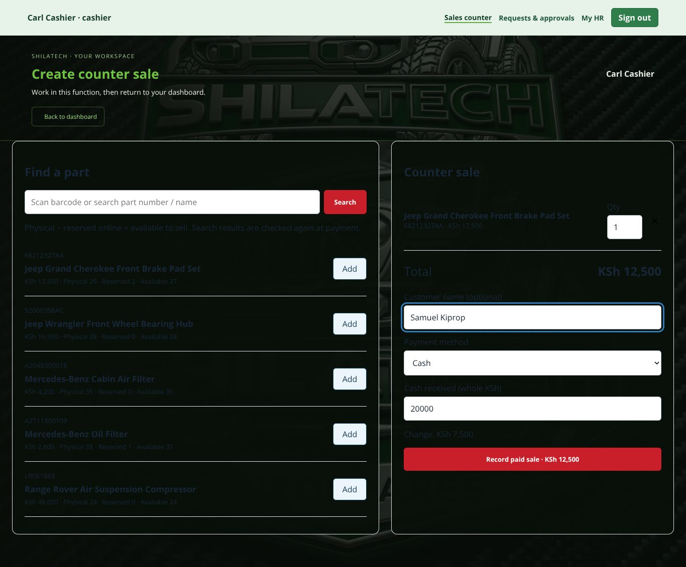

*A cash sale ready to record: part added, customer name and cash received entered.*

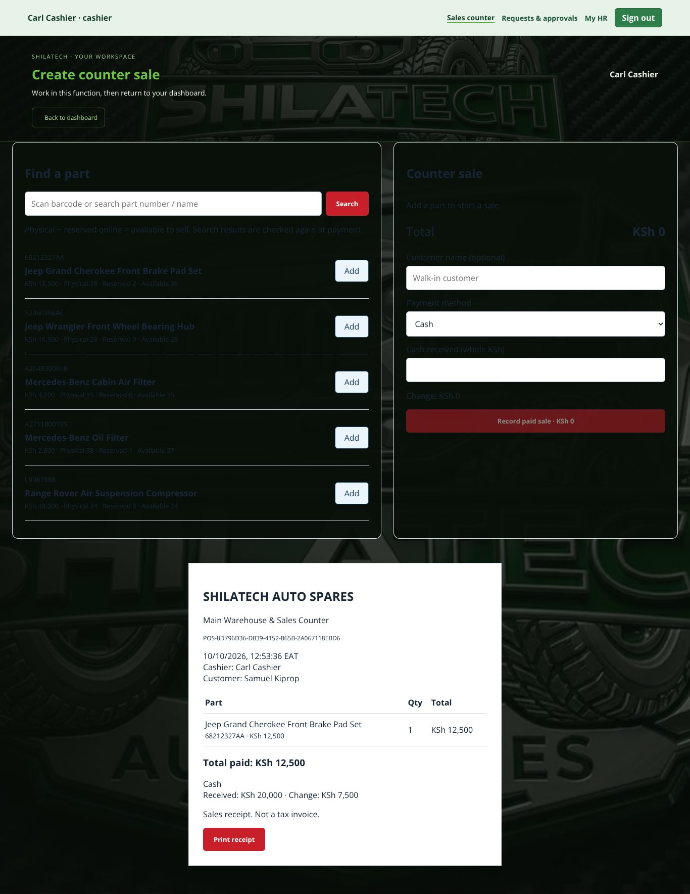

*The receipt after pressing *Record paid sale*; press *Print receipt*.*

1. **Find a part** — type the part name, number or **scan the barcode**, press **Search**. The list shows availability (physical stock minus quantities reserved by online orders). Press **Add** to put a part on the sale.
2. **Counter sale** panel — set the quantity (**Qty**) for each line, or press **×** to remove one.
3. Enter **Customer name** (optional).
4. Choose **Payment method**:
   - **Cash** — enter *Cash received*. The screen shows the **change**.
   - **M-Pesa** or **Card** — enter the **Confirmed payment reference**. This records a payment you have **already received and checked yourself**; the system does not charge or verify M-Pesa/card payments.
5. Press **Record paid sale**.
6. The **receipt** opens. Press **Print receipt**. Receipts are *sales receipts, not tax invoices*.

### Recent receipts

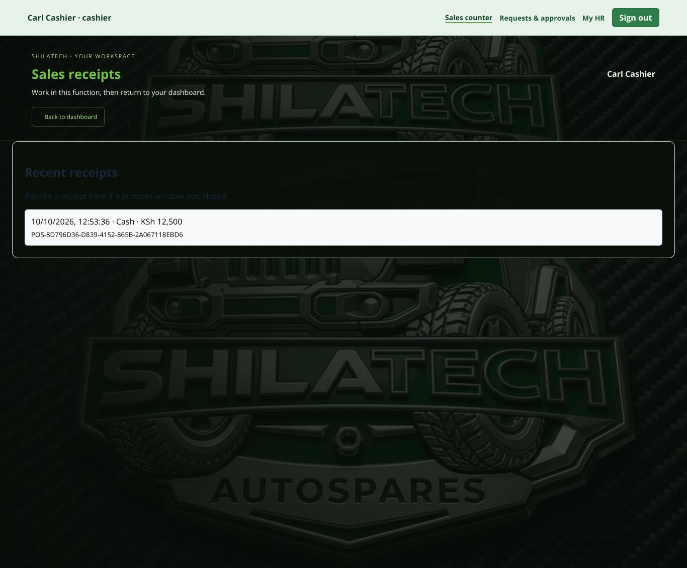

*Recent receipts: click one to reopen and reprint.*
Use **Recent receipts** to reopen and reprint a receipt (for example if the window was closed). Cashiers see their own receipts.

### Important safety rules

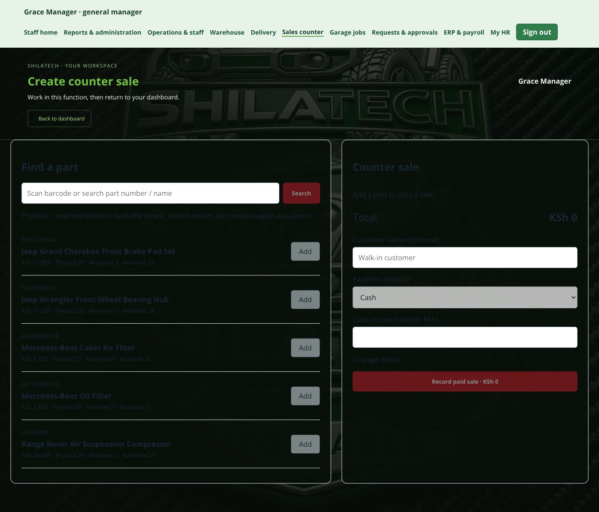

*General manager's view of the counter: inputs are greyed out (read-only).*

- If a **"pending sale"** warning appears, the result is uncertain. **Retry the same sale** with the same details to retrieve its receipt — **never collect payment twice**.
- Do not start the same sale in two browser tabs.
- If stock looks wrong, stop and tell the warehouse manager.
- Completed sales cannot be edited. For a refund or correction, raise a request in **Requests & approvals** ([2.8](#28-requests--approvals)).
- The page header shows approved refund credits for the day.

## 2.6 Garage jobs

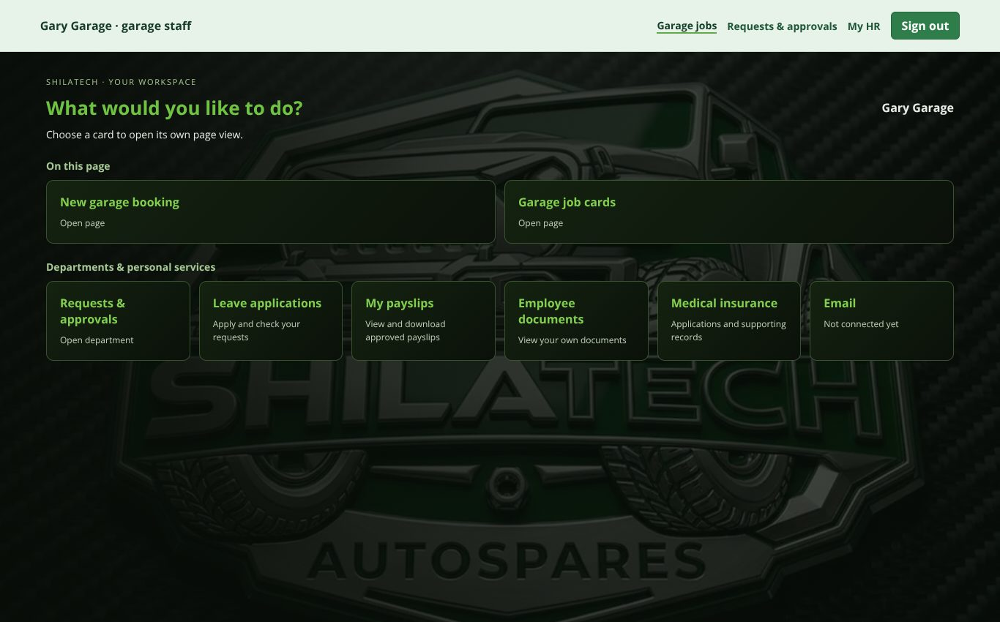

*Garage dashboard.*

**Open:** staff bar → **Garage jobs** (`/staff-garage`). Roles: garage staff and administrator; general manager can view.

Use it to enter workshop bookings received by WhatsApp or at the counter, and to track repairs. It does **not** import WhatsApp messages.

### New booking

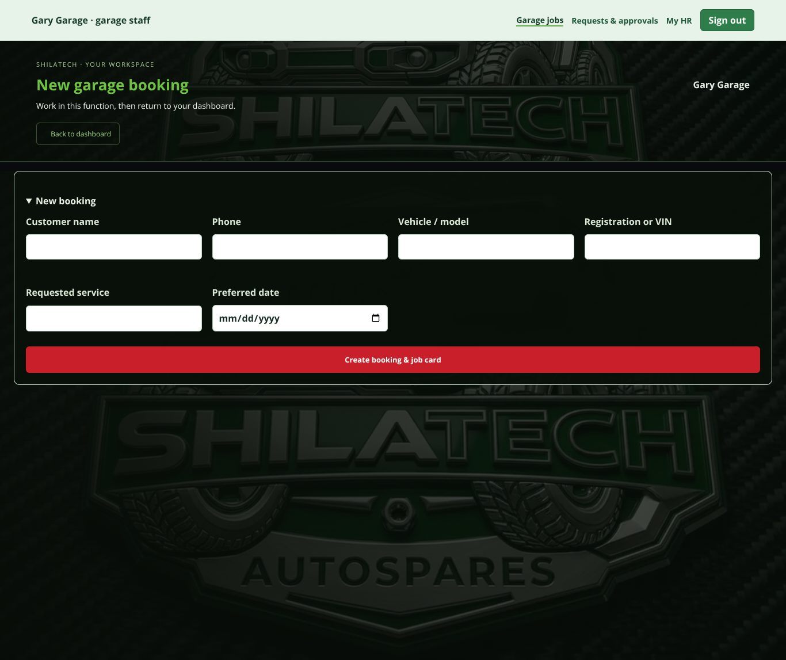

*New garage booking form.*
Open **New booking** and fill in customer name, phone, vehicle / model, registration or VIN, requested service and preferred date. Save to create a **job card** (with a job number).

### Job cards

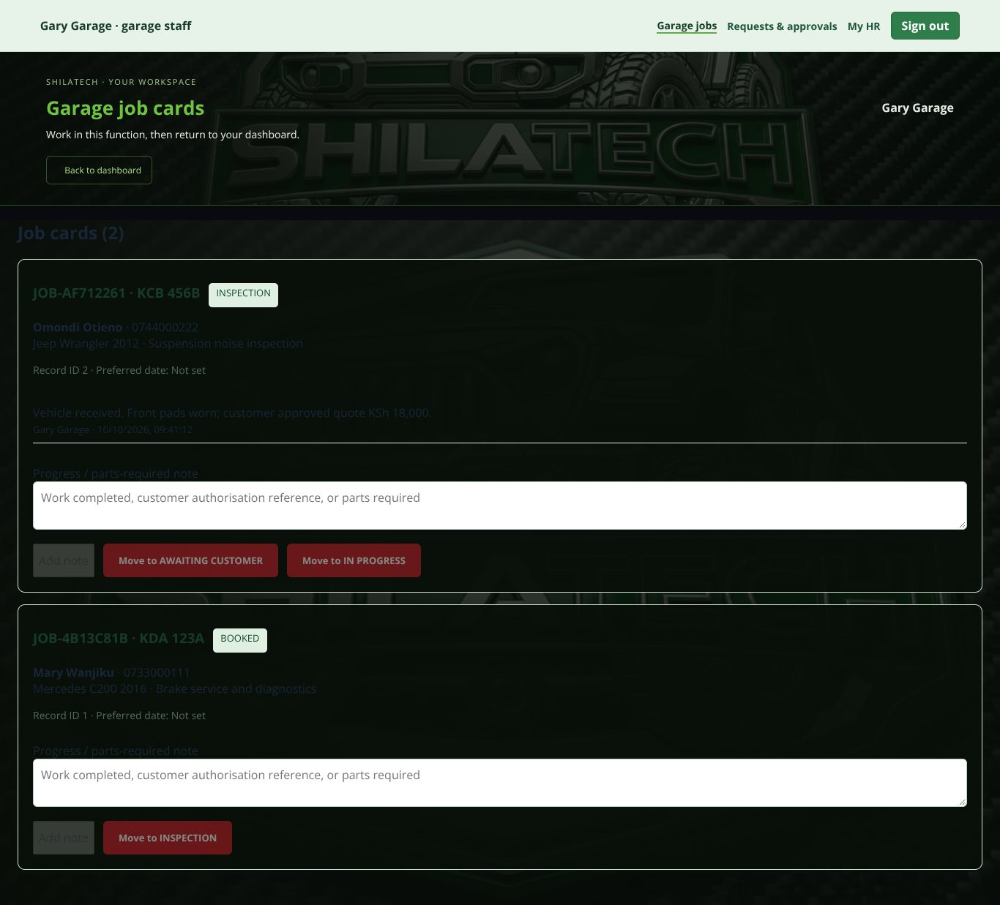

*Job cards with notes and *Move to …* buttons.*
Each job card shows the job number, registration, customer, vehicle, service, status and a history of notes.

1. Type in **Progress / parts-required note** (work done, customer authorisation reference, or parts needed).
2. Press **Add note** to save the note only, **or** press **Move to …** to advance the status and save the note.
3. A note is **required** to save or move a job. Notes can only be added, never edited.

**Job progress order:** Booked → Inspection → Awaiting customer / In progress → Ready → Completed.
(From *Inspection* you can go to *Awaiting customer* or *In progress*; from *Awaiting customer* to *In progress*.)

Parts you write in notes **do not** reduce stock or charge the customer. Sell or issue parts through the warehouse or sales counter.

To **cancel, reopen or correct** a job, press **Request a correction, cancellation or reopening** (goes to [Requests & approvals](#28-requests--approvals)).

## 2.7 Delivery

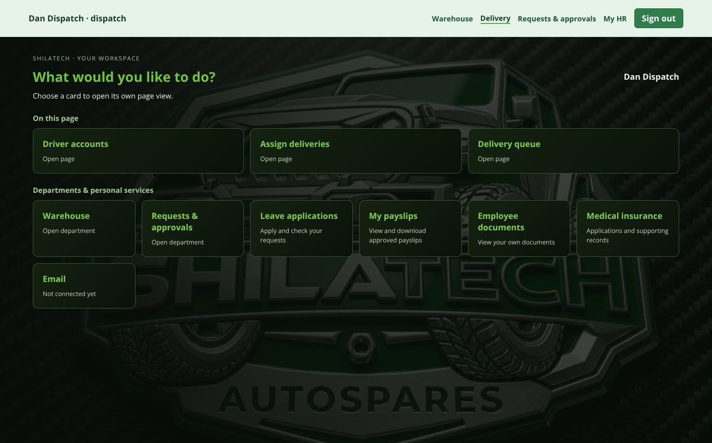

*Delivery dashboard for dispatch.*

**Open:** staff bar → **Delivery** (`/delivery`). Roles: delivery drivers, dispatch, administrator; general manager can view.

The delivery portal is designed to work on a **phone or PDA**.

### For managers / dispatch — "Delivery Control Centre"

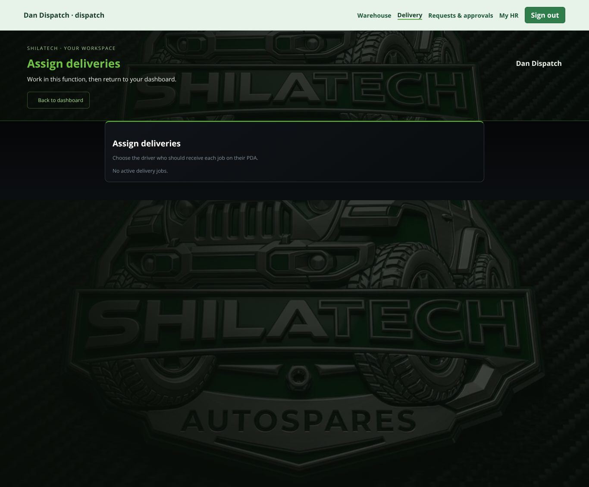

*Assign deliveries.*

- **Driver accounts** — create a secure login for each driver (**administrator only**; press **Save driver**).
- **Assign deliveries** — for each waiting job, pick the driver from the list and press **Apply** (dispatch and administrator).
- **Active delivery queue** — watch jobs in progress.

### For drivers — "My Assigned Deliveries"

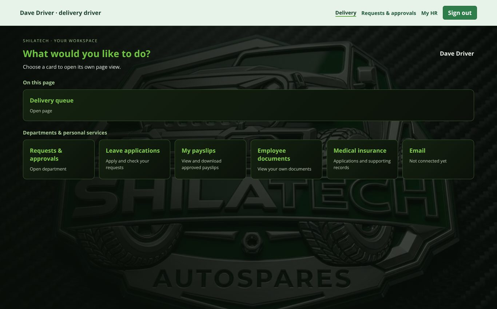

*Delivery dashboard for a driver.*

1. Open your **delivery queue** — only jobs assigned to you appear.
2. Use **Call customer** and **Open address** (opens your maps app).
3. If the customer is paying by M-Pesa, press **Prompt Customer to Pay**, then **Refresh payment status** until paid. **Proof of delivery is blocked while payment is pending.**
4. At handover, open the proof form: confirm the **Recipient name**, have the customer sign in the **Customer signature** box (**Clear signature** to retry), add **Delivery notes** if needed, and submit. Allow the browser to share your **location** when asked.

## 2.8 Requests & approvals

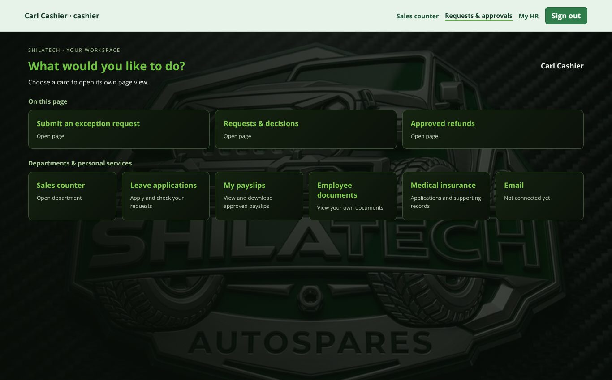

*Requests & approvals dashboard.*

**Open:** staff bar → **Requests & approvals** (`/approvals`). Available to every operational role.

Ordinary sales and receiving never need approval. **Exceptions** do. The approval chain is:

> **Staff member requests → General manager reviews → Administrator applies.**
> A request made by the general manager goes straight to the administrator. A request made by the administrator still needs general manager review before the administrator applies it.

Nothing changes until the administrator applies it. Pending requests never change prices, stock or completed sales.

### What each role can ask for

| Role | Request types |
|---|---|
| Cashier | Price change, Refund, Sale correction (own counter sales only) |
| Garage staff | Garage correction (cancel, reopen or correct a job) |
| Finance | Refund, Sale correction (payment reference or customer name), Order correction (order or payment status) — for any sale or order |
| Warehouse roles | Stock adjustment |
| General manager, Administrator | All types, including Order correction |

### Submitting a request

**Finance** staff can open this page too (staff bar → **Requests & approvals**, or the link at the top of *Sales & customer accounts*). They can see every request and approved refund, and raise the request types in the table above. They cannot review, approve or record payouts.

1. On the dashboard press the **Submit an exception request** card.
2. Choose the **Request type**. Depending on the type, also choose the **Sale type** (POS or ONLINE), the **record**, the **field** to change, the new value (for example *Order status* or *Payment record status*).
3. Write the **Reason and supporting reference** — explain the original error and the exact correction.
4. Press **Submit for approval**. Nothing changes yet — the request goes to the general manager for review and then to the administrator.

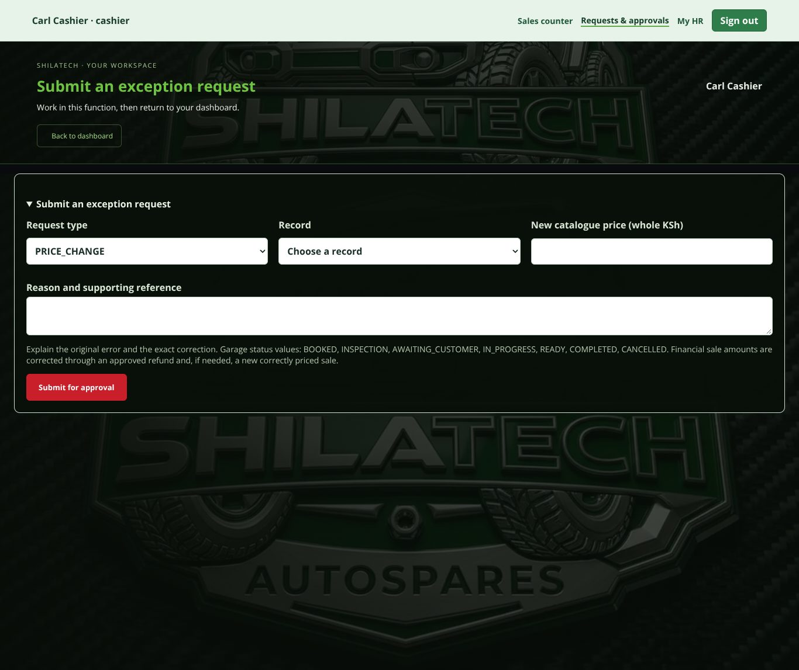

*Submit an exception request (cashier: price change, refund or sale correction).*

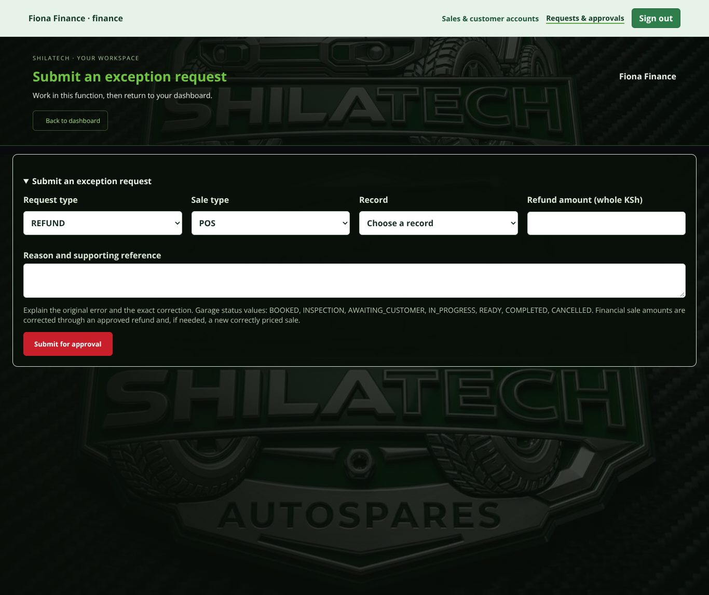

*The same form for the Finance role: refund, sale correction or order correction.*

### Following a request

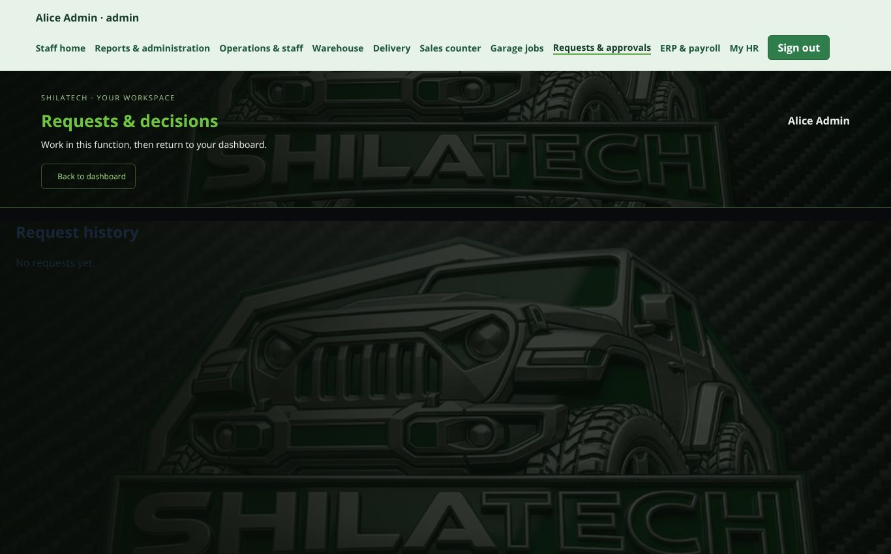

*Requests & decisions.*
**Requests & decisions** (card *Requests & decisions*) lists every request, who requested and reviewed it, and the notes. Reviewers add a **Decision note** and approve, reject or apply.

### Refunds
- An approved refund creates a **credit** only. It **does not send money** and does **not return stock**.
- Pay the customer **outside** the system (M-Pesa, bank or cash). Then the administrator opens **Approved refunds** and uses **Record completed external payout**, entering the **actual transfer reference / cash voucher**. Never pay twice.
- A stock return after a refund is a separate **Stock adjustment** request after a physical count.

## 2.9 Sales & customer accounts (Receivables) and Finance workspace

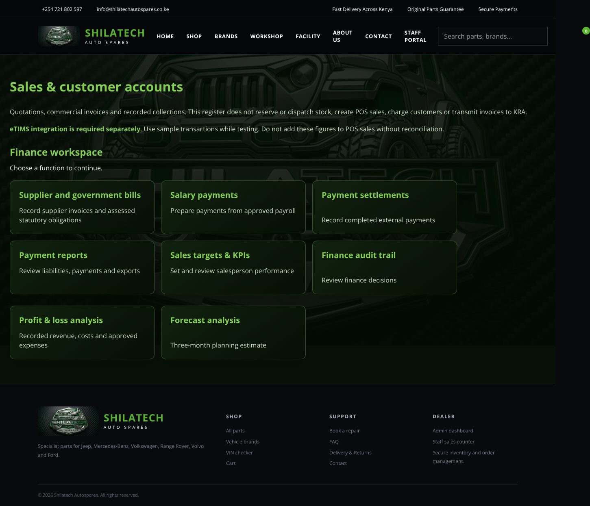

*Sales & customer accounts page (note: normal website header, no staff bar).*

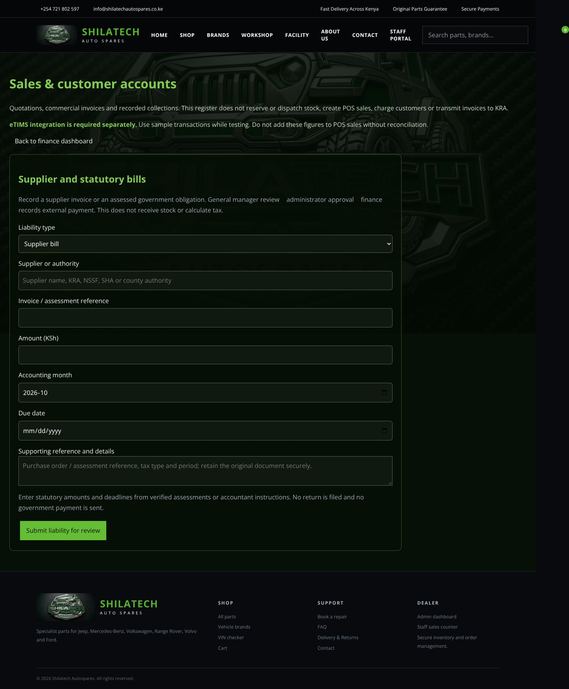

*Finance workspace → Supplier and government bills.*

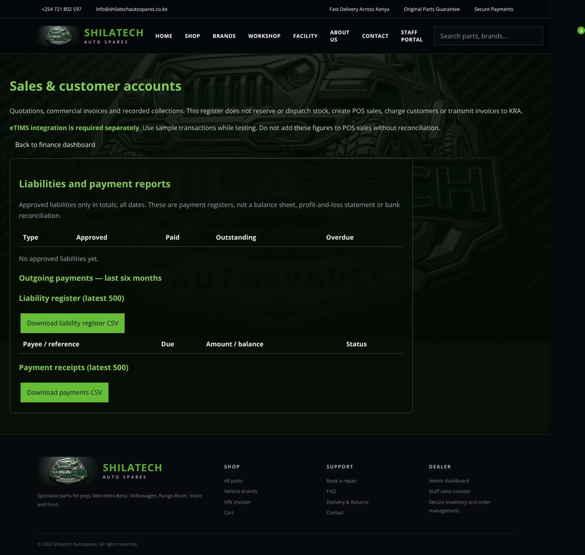

*Finance workspace → Payment reports.*

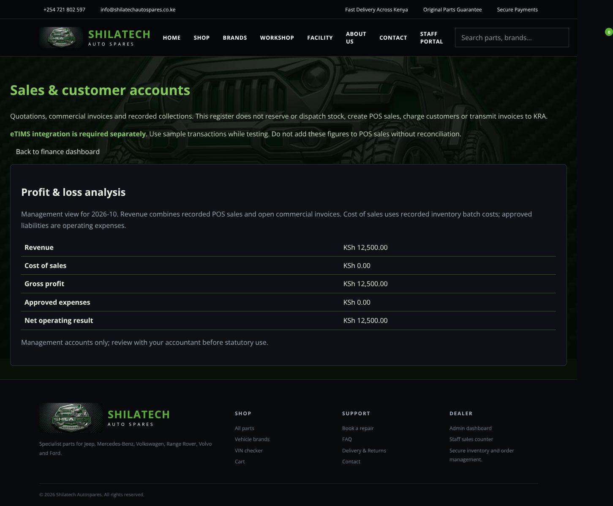

*Finance workspace → Profit & loss analysis.*

**Open:** type `/receivables` after the website address (for example `https://your-site/receivables`). **Finance** staff land here automatically after signing in. There is **no link to it in the staff bar** of other departments, and this page shows the normal website header rather than the staff bar. A **Requests & approvals** link at the top of the page opens the requests page (where Finance gets the full staff bar). Use the browser's Back button or return to `/staff` to leave.

Roles: **administrator** and **finance** (everything), **cashier** (own documents and own sales performance), **general manager** (view).

**First use:** if you see **Enable sales and finance records** or **Enable extended finance**, ask the administrator to press the button once (it only creates empty records).

The page opens on **Finance workspace — "Choose a function to continue."** Press a card to open that function. Use **Back to finance dashboard** to return.

| Card | What it does |
|---|---|
| **Supplier and government bills** | Record a supplier invoice or an assessed government obligation: type, payee, reference, amount, accounting month, due date and details. Press **Submit liability for review**. Flow: *general manager review → administrator approval → finance records external payment.* No government payment is sent and no return is filed. |
| **Salary payments** | Import an already approved payroll once with **Add approved salary to payments**, then pay by bank/M-Pesa outside the system. |
| **Payment settlements** | Finance or administrator records a completed payment: pick the approved liability, amount, method, the **unique bank / payment receipt reference** and date. |
| **Payment reports** | Totals (approved, paid, outstanding, overdue), outgoing payments, the liability register and payment receipts, with **CSV downloads**. |
| **Sales targets & KPIs** | Monthly counter-sales targets per salesperson (set by the administrator). Cashiers see their own performance. |
| **Finance audit trail** | Review finance decisions. |
| **Profit & loss analysis** | Revenue (POS sales and open commercial invoices), cost of sales, gross profit, approved expenses and net operating result for the month. Management view only — check with your accountant. |
| **Forecast analysis** | A three-month planning estimate. Not a guarantee or cash-flow forecast. |

Reviewers (general manager, then administrator) approve or reject pending liabilities with a decision reason. Settled records can't be edited or deleted.

### Customer accounts, quotations and invoices
The same page also contains an **account-customer register** for companies and garages that buy on quotation or credit: *Add account customer, Approve customer credit* (administrator), *Create quotation* (catalogue prices, valid 14 days, stock not reserved), *Create invoice from quotation* (payment on issue, or 30 days for approved-credit customers), *Record invoice payment* (finance/administrator), *Document history* (print/save as PDF; administrator can void an unpaid document) and *Receivables reports*. These documents are **internal commercial records — not eTIMS tax invoices**, and they do not reserve or dispatch stock.

> **Known issue:** in the current version these customer, quotation and invoice forms are hidden by the finance function view and cannot be opened. See [3.4](#34-known-issues-for-the-administrator--it).

## 2.10 ERP & payroll

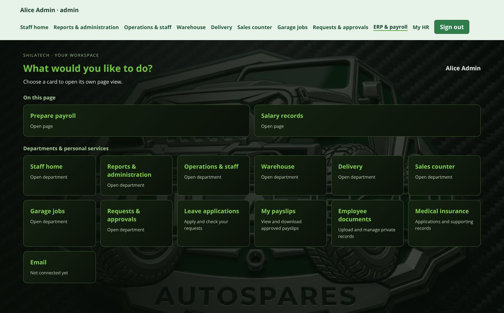

*ERP & payroll dashboard.*

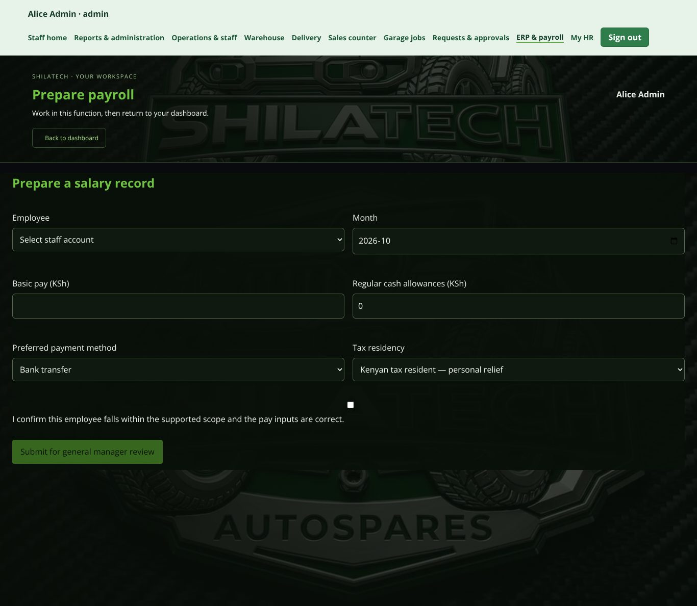

*Prepare a salary record.*

*Salary records.*

**Open:** staff bar → **ERP & payroll** (`/payroll`). **Administrator and general manager only.** Nobody else can see salary data.

Workflow: **Administrator prepares → General manager reviews → Administrator approves.**

1. **First use:** the administrator presses **Initialise payroll** (creates empty tables only).
2. **Prepare a salary record** (administrator): choose the **Employee**, **Month**, **Basic pay**, **Regular cash allowances**, **Preferred payment method** (*Bank transfer* or *M-Pesa*) and **Tax residency**. A **Calculation preview** shows NSSF, SHIF, housing levy, PAYE and net pay. Press **Submit for general manager review**.
3. The **general manager** opens the record under **Salary records**, adds a **Review note** and approves or rejects it. The preparer cannot review their own record.
4. The **administrator** gives final approval.
5. After approval, press **Print approved payslip (A5)**. In the print window choose **A5, portrait, 100% scale**, and turn off browser headers and footers.

**Important:** approval **does not pay employees** or remit statutory deductions. Payslips say "approved — payment not sent". Rejected records can be replaced; submitted amounts can't be edited. Rules cover **February–December 2026** regular monthly cash pay only. A qualified person must verify the figures before real payments or tax filing.

## 2.11 My HR

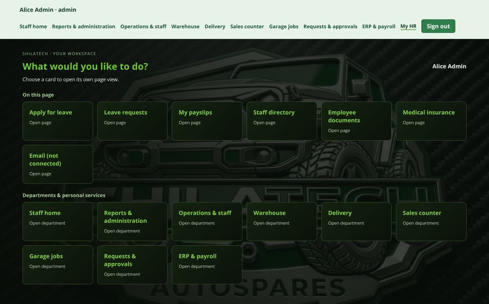

*My HR dashboard.*

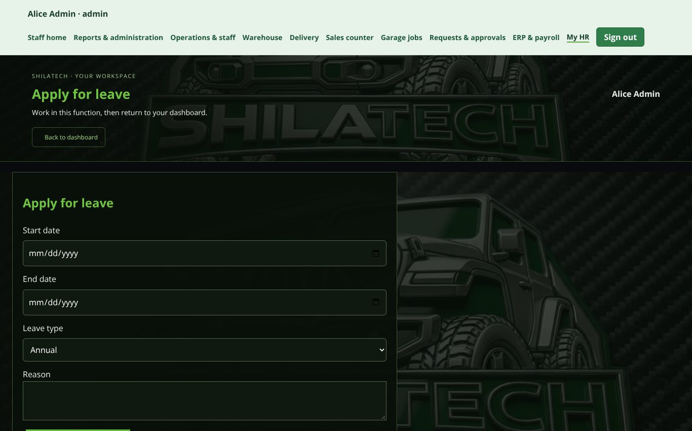

*Apply for leave.*

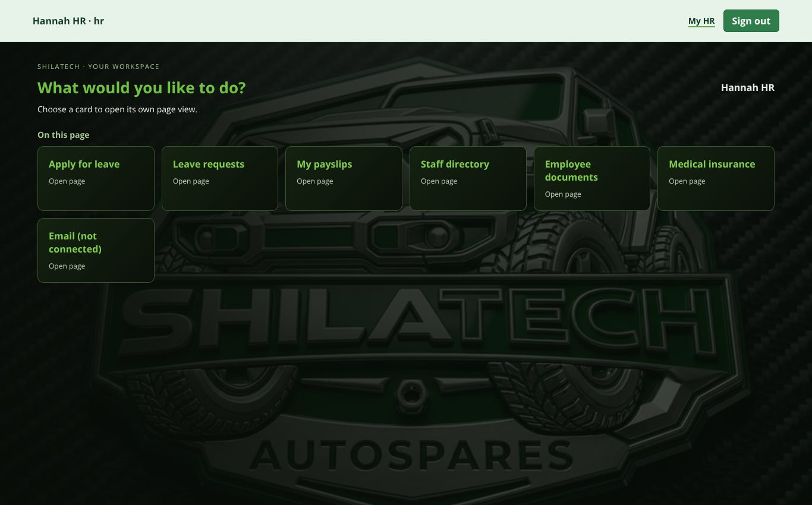

*HR administration view (HR role).*

**Open:** staff bar → **My HR** (`/my-hr`). Every staff member has it. For the **HR** role it is the only page and is titled **HR administration**.

Sections (jump links at the top): **Leave applications · My payslips · Email · Employee documents · Medical insurance · Staff directory** (managers/HR only).

- **Apply for leave:** choose start and end dates, leave type (*Annual*, *Sick*, *Unpaid*), give a reason, press **Submit leave application**. Track it under **My leave requests**.
- **Leave approval flow:** the request goes to **HR**, who adds a note and presses **Forward to general manager**; the **general manager** then presses **Approve leave** or **Reject leave**. A review note is required each time. No administrator approval is needed.
- **My approved payslips:** press **View payslip [period]** to see it; **Print / Save payslip as PDF (A5)** to print. Only your own payslips appear.
- **Employee documents:** staff can view their own. HR and the administrator **upload private documents** (choose staff member, document type, file up to 2 MB). Downloads are logged.
- **Medical insurance applications:** HR creates a draft for a staff member, attaches supporting documents, and forwards it to the general manager. Internal approval does **not** enrol anyone with an insurer.
- **Email:** placeholder only — no mailbox is connected.
- **First use:** HR or the administrator may need to press **Enable HR records** once.

## 2.12 Reports & administration (Admin dashboard)

*Reports & administration dashboard.*

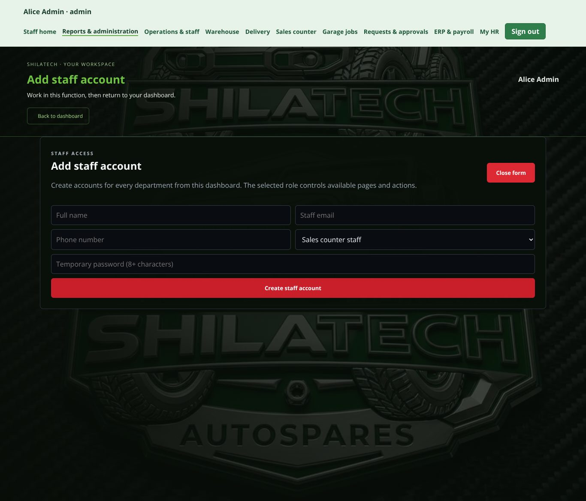

*Add staff account (press *Add staff* to open the form).*

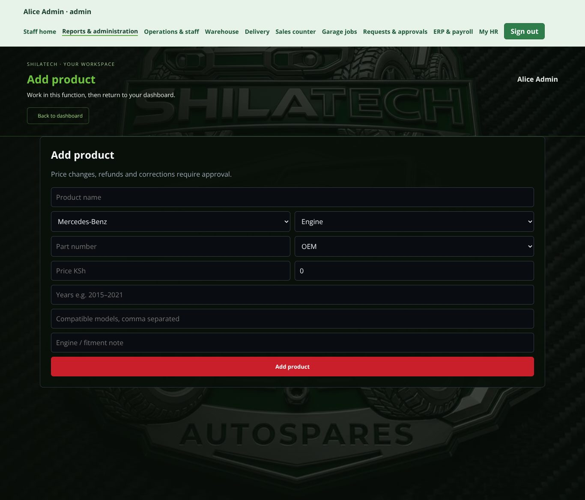

*Add product.*


*Recent order pipeline.*


*Products table.*

**Open:** staff bar → **Reports & administration** (`/admin`). Administrator (general manager: view only).

Shows live inventory, orders, customers and sales performance. *Net sales* = online + counter sales, less approved refund credits.

- **Add staff account** — create accounts for every department; the selected **role** controls what that person can open. New accounts start with a temporary password and must change it at first sign-in.
- **Add product** — choose brand, category, OEM/Aftermarket, and details. Products are created with **zero stock**; add stock in the Warehouse.
- **Recent order pipeline** — online orders with customer, total, payment, status and date. Press **Refresh** to reload. Orders can be updated here by the administrator, subject to the approval rules for corrections and refunds.
- **Products** table — part, brand, category, price, stock and state.

## 2.13 Operations & staff (management)


*Operations & staff dashboard.*


*Add supplier.*


*Create purchase order.*


*Create employee.*


*Low stock alerts.*


*Employee access: change role or reset password.*

**Open:** staff bar → **Operations & staff** (`/operations`). Administrator (general manager: view only).

Title: **Management Operations Centre.**

- **Add supplier** → **Save supplier.**
- **Create purchase order** — choose supplier and part, enter quantity, press **Create PO**. See them under **Recent purchase orders**.
- **Low stock alerts** — parts at or below their reorder level, with a *Suggested order*. Edit **Reorder level** / order quantity and press **Save**.
- **Create employee** — name, email, phone, **role**, temporary password (minimum 8 characters). The new person must change it at first sign-in.
- **Employee access** — for each staff member you can:
  - change their **Staff role** (the administrator's own role cannot be changed here), and
  - **Reset password** — set a new temporary password. They must change it at next sign-in, and their existing sessions are signed out.

**Tip:** create a **general manager** account here before submitting administrator requests — the approval chain needs one.

---

# Part 3 — Quick reference

## 3.1 Page address (URL) list

**Public**

| Address | Page |
|---|---|
| `/` | Home |
| `/shop` | Parts catalogue (`/shop?brand=Jeep`, `/shop?category=Brakes`, `/shop?q=…`) |
| `/product/<name>` | Product page |
| `/brands` | Brands |
| `/vin` | VIN checker |
| `/cart` , `/checkout` | Cart and checkout |
| `/account` | Customer account and My Garage |
| `/workshop` | Garage services and booking |
| `/facility` , `/about` , `/contact` , `/faq` , `/delivery-returns` | Information pages |

**Staff**

| Address | Page |
|---|---|
| `/staff-login` | Staff sign-in |
| `/staff-password` | Change password |
| `/staff` | Staff centre |
| `/warehouse` | Warehouse |
| `/pos` | Sales counter |
| `/staff-garage` | Garage jobs |
| `/delivery` | Delivery |
| `/approvals` | Requests & approvals |
| `/receivables` | Sales & customer accounts + Finance workspace |
| `/payroll` | ERP & payroll |
| `/my-hr` | My HR |
| `/admin` | Reports & administration |
| `/operations` | Operations & staff |
| `/api/health` | Technical check that the database is reachable (for IT) |

## 3.2 Troubleshooting

| Problem | What to do |
|---|---|
| "Welcome to the staff portal… available only to authorised staff" | Sign in at `/staff-login`, or use *Open my department* if your role does not include that page. |
| "Change your temporary password" screen | Press **Change password**; use at least 12 characters. |
| Cannot sign in | Check email and password. Staff and customer accounts are separate. Ask the administrator to reset your password in **Operations & staff → Employee access**. |
| A page shows greyed-out / "viewing only" | You are a **general manager**. Use **Requests & approvals** to propose changes. |
| Warehouse shows only one brand | Your account is assigned to that brand (email begins with the brand name). |
| Receipt window closed before printing | Sales counter → **Recent receipts** → reopen and **Print receipt**. |
| "Pending sale" warning at the counter | Retry the **same** sale. Never take payment again. |
| "Stock reconciliation required" | Stop selling that part. Tell the warehouse manager; stock needs a physical count and, if needed, a Stock adjustment request. |
| Proof of delivery blocked | Customer's M-Pesa payment is still pending. Press **Prompt Customer to Pay**, then **Refresh payment status**. |
| "Enable HR records" / "Initialise payroll" / "Enable sales and finance records" buttons | A one-time setup by the administrator. Ask them. |
| VIN rejected | It must be 17 characters; no I, O or Q. If it still fails, search manually in the Shop. |
| Website is slow to load after being idle | Reload the page and sign in again if asked. |
| Database error / `/api/health` shows "unavailable" | Tell IT: the database connection or setup (migrations) needs attention. |

## 3.3 Things that are not connected yet

So nobody is misled, these are **not** automatic at the moment:

- **Contact page form** — "Send enquiry" does not send; use phone, email or WhatsApp.
- **Card and PayPal payments** — selectable at checkout, but live charging needs provider credentials. M-Pesa online prompts also need provider credentials.
- **M-Pesa / card at the sales counter** — you record a payment you have already verified; the system does not check it.
- **Refunds and payroll** — approval records the decision only. No money is sent to customers or employees; statutory deductions are not remitted.
- **KRA eTIMS tax invoices** — documents are internal records only.
- **Email (staff)** — placeholder; no mailbox connected.
- **Branch counters** — only the Main business location is active.
- **WhatsApp bookings** — the website opens WhatsApp for the customer; bookings are **not** imported. Garage staff enter them manually.
- **Malware scanning** of HR document uploads is not connected — upload only necessary files.

## 3.4 Known issues (for the administrator / IT)

These were found while preparing this manual by running the site against a test database. They are application problems, not user mistakes.

| # | Where | What happens | Effect |
|---|---|---|---|
| 1 | Sales & customer accounts (`/receivables`) | All customer / quotation / invoice panels are hidden whenever the Finance workspace is shown. | Quotations, invoices and credit limits can't be used. Finance functions work. |
| 2 | New database setup | `pnpm db:migrate` fails on a brand-new empty database at the last step (`must_change_password` column used before it is created). | Only affects setting up a fresh database, not the live one. |
| 3 | Contact page | "Send enquiry" button does nothing. | Use phone, email or WhatsApp. |

**Fixed in this version** (after being found while preparing the first draft of this manual): the *Submit an exception request* form could not be opened; the *Change your temporary password* screen did not appear when a page was opened directly; the header's account and cart icons were pushed off-screen at about 1366 px; dark-on-dark text on the Sales counter, Garage and other staff function pages; and broken brand logos on Brand warehouses. Finance can now view and raise requests under *Requests & approvals*.

---

*Shilatech Auto Spares — Nairobi, Kenya · +254 721 802 597 · info@shilatechautospares.co.ke*
